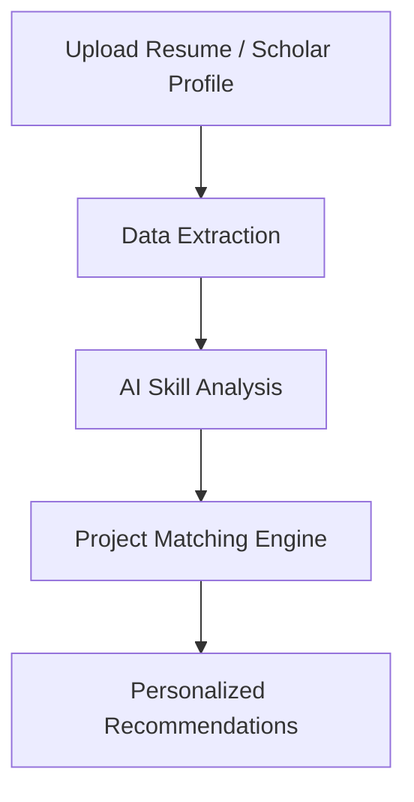

# ScholarSync

### AI-Powered Academic & Career Intelligence Platform

ScholarSync is an AI-powered platform designed to bridge the gap between a student’s academic profile and real-world project opportunities. By combining resume analysis, skill extraction, and academic research insights, ScholarSync intelligently recommends personalized projects, helping students build stronger portfolios and practical experience.

Built with modern full-stack technologies, ScholarSync focuses on creating a seamless workflow for students, researchers, and aspiring developers looking to align their skills with impactful projects.

---

## Features

### Smart Resume Parsing

* Upload PDF/DOCX resumes
* Extracts:

  * Skills
  * Education
  * Experience
  * Technologies
  * Contact details
* AI-enhanced parsing with intelligent fallback support

### Google Scholar Integration

* Connect Google Scholar profiles
* Analyze:

  * Publications
  * Research interests
  * Citation metrics
  * Academic domains
* Maps academic interests to technical skills

### AI-Powered Project Recommendations

* Generates personalized project suggestions
* Matches projects based on:

  * Skills
  * Research interests
  * Experience level
  * Missing skill gaps
* Helps users discover portfolio-worthy ideas

### Intelligent Recommendation Engine

* Skill matching algorithm
* Match percentage scoring
* Relevance-based ranking
* Missing skills analysis

### Modern Responsive UI

* Clean and responsive interface
* Smooth user experience
* Built with Tailwind CSS
* Optimized for desktop and mobile

### Secure & Reliable

* File validation
* Safe document handling
* Error handling & fallback systems
* AI failure recovery mechanisms

---

## Tech Stack

### Frontend

* Next.js
* React
* TypeScript
* Tailwind CSS
* Material UI

### Backend

* Next.js API Routes
* Node.js

### AI & Processing

* OpenAI API / Gemini API
* PDF Parsing (`pdf-parse`)
* DOCX Parsing (`mammoth.js`)
* Web Scraping (`cheerio`)

### Additional Tools

* React Hook Form
* Lucide Icons

---

## How It Works



1. User uploads a resume or connects a Google Scholar profile
2. ScholarSync extracts and analyzes data
3. AI identifies skills, interests, and expertise
4. Recommendation engine finds suitable project ideas
5. User receives curated project suggestions with skill insights

---

## Core Use Cases

* Students building strong portfolios
* Researchers exploring practical implementations
* Developers looking for project inspiration
* Internship preparation
* Resume enhancement through guided projects

---

## Installation

```bash
# Clone repository
git clone https://github.com/Shaurya000-png/ScholarSync.git

# Navigate into project
cd ScholarSync

# Install dependencies
npm install

# Start development server
npm run dev
```

---


## Future Improvements

* AI roadmap generation
* Internship recommendation system
* GitHub profile integration
* Skill progression tracking
* Team collaboration features
* AI mentor/chat assistant

---

## Contributing

Contributions are welcome.

To contribute:

1. Fork the repository
2. Create a feature branch
3. Commit changes
4. Open a pull request

---

## License

This project is licensed under the MIT License.

---

## Author

Developed by Shaurya Pratap Singh


---

## Support

If you found this project useful, consider starring the repository on GitHub.
